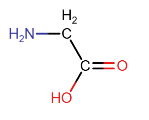
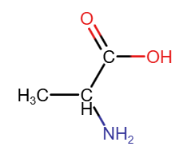
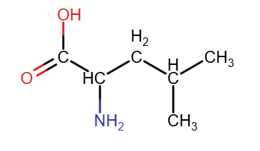
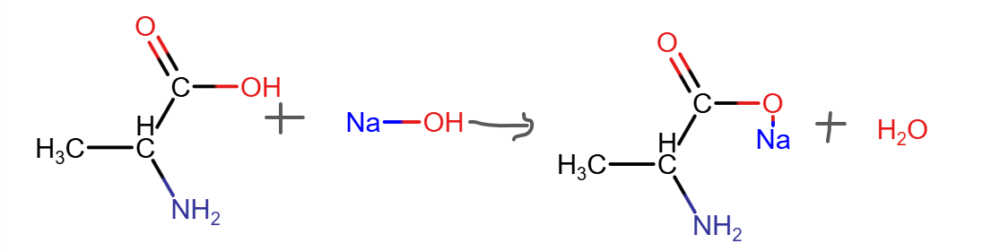
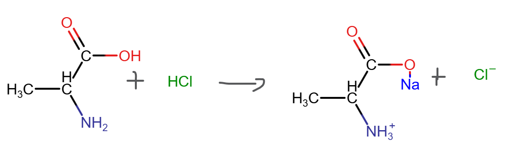
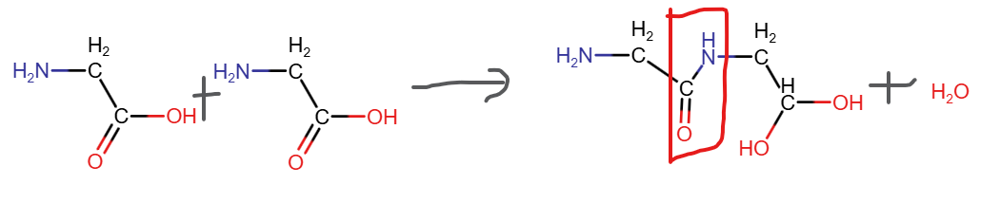
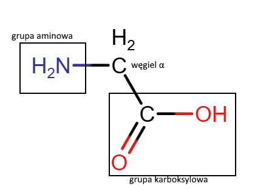

# 1. Aminokwasy
Aminokwas jest związkiem dwufunkcyjnym, ma dwie grupy funkcyjne
- NH2 - grupa aminowa (**amino-**)
- COOH - grupa karboksylowa (**-kwas**)
## 1.1 przykłady
- Kwas 2-aminoetanowy *glicyna*
	
- kwas 2-aminopropanowy *alanina*
	
- kwas 2-amino-4-metylopentanowy *leucyna*
	
## 1.2 podział
### 1.2.1 ze względu na ilość grup
- obojętne (NH2 = COOH)
- zasadowe (NH2 > COOH)
- kwasowe (NH2 < COOH)
### 1.2.2 ze względu na syntezowanie w organizmie
- egzogenne - nie syntezowane w organizmie
- endogenne - syntezowane w organizmie
## 1.3 właściwości
### 1.3.1 fizyczne
- ciała stałe
- krystaliczne
- dobrze rozpuszczalne w wodzie
### 1.3.2 chemiczne
- w roztworze występują w postaci jonu obojnaczego / soli wewnętrznej (H z grupy karboksylowej wędruje do grupy aminowej)(COOH, NH2 -> COO-, NH3+)
	
- aminokwasy wykazują właściwości amfoteryczne, czyli zarówno właściwości kwasowe, jak i zasadowe
	
	
- kondensacja (peptyzacja) - łączenie się aminokwasów w długie łańcuchy poprzez połączenie się się grup karboksylowej i aminowej, powstaje wtedy wiązanie peptydowe -CONH-, (zaznaczone czerwoną ramką), wydziela się również woda
	
- Aminokwasy białkowe to α-aminokwasy, czyli takie w których obie grupy są połączone z tym samym węglem, tzw. węglem α
	
# 2. Białka - właściwości fizyczne i chemiczne
Białko to łańcuch aminokwasowy, złożony z ponad 100 reszt aminokwasów, połączonych wiązaniami peptydowymi -CONH-
## 2.1 podział białek
- białka proste - złożone tylko z reszt aminokwasowych
- białka złożone - zawierają również składniki niebiałkowe (np. hem w hemoglobinie)
## 2.2 właściwości fizyczne
- wysalanie i koagulacja - niektóre białka w połączeniu z wodą tworzą koloid (cząsteczki białka są otoczone cząsteczkami wody, przez co się nie strącają), pod wpływem NaCl, woda gromadzi się przy jonach soli, przez co cząsteczki białka łączą się w zespoły i zaczynają się wytrącać, **proces ten można odwrócić, dodając wody**
- denaturacja - na skutek czynników takich jak temperatura, alkohole, sole metali ciężkich czy promieniowanie struktura białka zostaje trwale zniszczona, a samo białko traci swoje właściwości, **tego procesu nie można odwrócić**
## 2.3 wykrywanie białek (właściwość chemiczna)
do wykrycia białek można wykorzystać m.in. 2 reakcje:
- reakcję ksantoproteinową - dodajemy do białka **kwas azotowy (V)**, w efekcie białko zmienia kolor na żółty
- reakcję biuretową - dodajemy do białka roztwór **siarczanu (VI) miedzi (II)** i nadmiar zasady (np. NaOH), białko przybiera zabarwienie fioletowe
## 2.4 trawienie białek
białka ulegają hydrolizie kwasowej, zasadowej i enzymatycznej. Trawienie białek polega m.in. na rozrywaniu wiązań peptydowych w obecności różnych enzymów (np. pepsyny, trypsyny)
## 2.5 hydroliza białek
polega na dzieleniu białka na coraz mniejsze fragmenty później, białka proste, polipeptydy a w końcu wolne aminokwasy

# 3. Białka - struktura przestrzenna
Wydzielamy cztery rzędy struktury białek:
## 3.1 struktura pierwszorzędowa 
określa jedynie sekwencję aminokwasów w łańcuchach
## 3.2 struktura drugorzędowa
określa lokalne ułożenie łańcucha polipeptydowego (wzajemne relacje najbliższych sobie aminokwasów), może mieć postać α-helisy lub β-harmonijki, stabilizują ją wiązania wodorowe ==patrz str. 52==
## 3.3 struktura trzeciorzędowa
określa jak wygląda w przestrzeni łańcuch zwiniętego łańcucha polipeptydowego, ta struktura decyduje o aktywności biochemicznej białka, stabilizują ją
- wiązania wodorowe
- mostki disiarczkowe
- oddziaływania jonowe
- siły van der Waalsa
## 3.4 struktura czwartorzędowa
określa wzajemny układ i połączenia podjednostek białkowych, np. dwóch łańcuchów o strukturze trzeciorzędowej
- wiązania wodorowe
- mostki disiarczkowe
- oddziaływania jonowe
- siły van der Waalsa
# 4. Białka - funkcje biologiczne
## 4.1 podział białek
- proste / złożone
- ze względu ma pochodzenie (zwierzęce, roślinne, bakteryjne)
- ze względu na występowanie (białka mleka, jaj)
- ze względu na pełnione funkcje biologiczne (transportowe, strukturalne, enzymy itd.)
## 4.2 funkcje białek
- enzymy są biologicznymi katalizatorami (zmniejszają wymagania środowiska reakcji, np temperatury i przyspieszają jej proces)
- białka pełnią rolę budulcową - z nich zbudowane są tkanki i organizmy
## 4.3 warto znać te białka
- insulina - zmniejsza ilość glukozy we krwi
- kolagen - buduje substancję międzykomórkową
- elastyna - główny składnik ścięgien