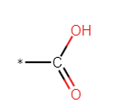
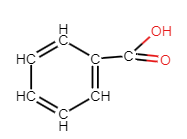
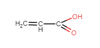
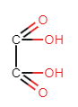
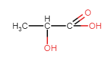
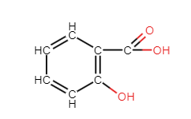
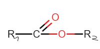
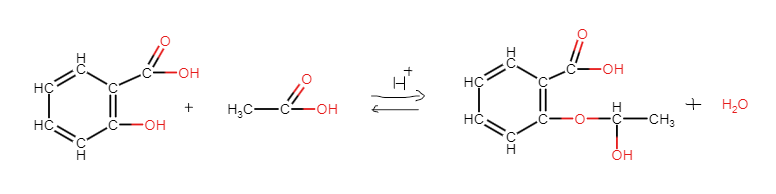
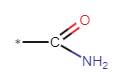
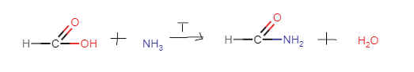

# 1. Kwasy karboksylowe

##  1.1 wzory

* wzór ogólny strukturalny (* = R)

	
* wzór ogólny sumaryczny
>R-COOH
## 1.2 podane kwasy
- HCOOH - kwas metanowy (mrówkowy)
- CH3COOH - kwas etanowy (octowy)
- C2H5COOH - kwas propanowy (propionowy)
- C3H7COOH - kwas butanowy (masłowy)
- C4H9COOH - kwas butanowy (walerianowy)
- kwas benzenokarboksylowy (benzoesowy)

	
- kwas propenowy (akrylowy)

	
- etanodiowy (szczawiowy)

	
- C15H31COOH - kwas palmitynowy
- C17H35COOH - kwas stearynowy
- C17H33COOH - kwas oleinowy
- 2-hydroksypropanowy (mlekowy) - hydroksykwas

	
- 2-hydroksybenzenokarboksylowy (salicylowy) - hydroksykwas

	
## 1.3 reakcje
### otrzymywanie
> Aldehyd + [O] -> kwas karboksylowy
> CH3CHO + [O] -> CH3COOH

### spalanie
> kwas karboksylowy + O2 -> CO2 + H2O
> kwas karboksylowy + O2 -> CO + H2O
> kwas karboksylowy + O2 -> C + H2O

### tworzenie soli
* z metalami
> 2 HCOOH + Mg -> (HCOO)2Mg* + H2^ 
>* metanian magnezu

* z tlenkami  metali
> 6 CH3COOH + Al2O3 -> 2 (CH3COO)3Al* + 3 H2O
> * octan glinu

* z wodorotlenkami
> C17H35COOH + NaOH -T-> C17H35COONa* + H2O
> * stearynian sodu (mydło)

- dysocjacja
> HCOOH -H2O-> HCOO- + H+
> C17H35COOH -H2O-> X (dysocjacja nie zachodzi dla wyższych kwasów karboksylowych)

* dekarboksylacja
> dekarboksylacja polega na *wydzieleniu* CO2 z cząsteczki kwasu karboksylowego 
> CH3COOH -T-> CH4 + CO2
> HCOOH -T-> H2^ + CO2

# 2. Estry
## 2.1 wzory
* wzór ogólny strukturalny

	
* wzór ogólny sumaryczny
> R1COOR2

## 2.2 estryfikacja
> kwas karboksylowy + alkohol/fenol <=H+=> ester + H2O

## 2.3 reakcje
### hydroliza kwasowa
> ester + H2O <=H+=> kwas karboksylowy + alkohol/fenol

### hydroliza zasadowa
> ester + MOH -> sól kwasu karboksylowego(M) + alkohol
> C3H7COOC4H9 + KOH -> C3H7COOK + C4H9OH

## 2.4 właściwości
* słabo rozpuszczalne w wodzie
* mają przyjemne zapachy
* występują jako substancje zapachowe w przyrodzie
* estry wyższych kwasów to woski
* estry wyższych kwasów i glicerolu to tłuszcze
* stosuje się je m.in. w przemyśle spożywczym, kosmetycznym i farmaceutycznym
# 3. Hydroksykwasy
## 3.1 budowa
> Hydroksykwasy posiadają 2 grupy funkcyjne:
> -COOH
> -OH 

## 3.2 przykłady
> 2 przykłady znajdują się na liście podanych kwasów karboksylowych

## 3.3 reakcje
* estryfikacja - otrzymywanie aspiryny

	

## 3.4 właściwości
- ciała stałe
- dobrze rozpuszczalne w wodzie
- są mocniejsze od odpowiadających sobie kwasów karboksylowych
# 4. Amidy
## 4.1 wzór
* wzór ogólny strukturalny (* = R)

	
## 4.2 otrzymywanie
* metanoamid

	
* mocznik
> H2CO3 + 2NH3 -T-> CO(NH2)2 + 2 H2O
> mocznik to końcowy produkt przemiany białek

## 4.3 poliamidy
> Amidy tworzą poliamidy
> - nici chirurgiczne
> - nylon
> - części maszyn